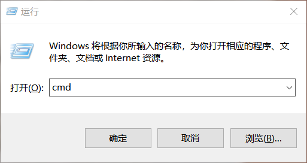
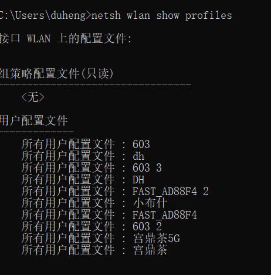
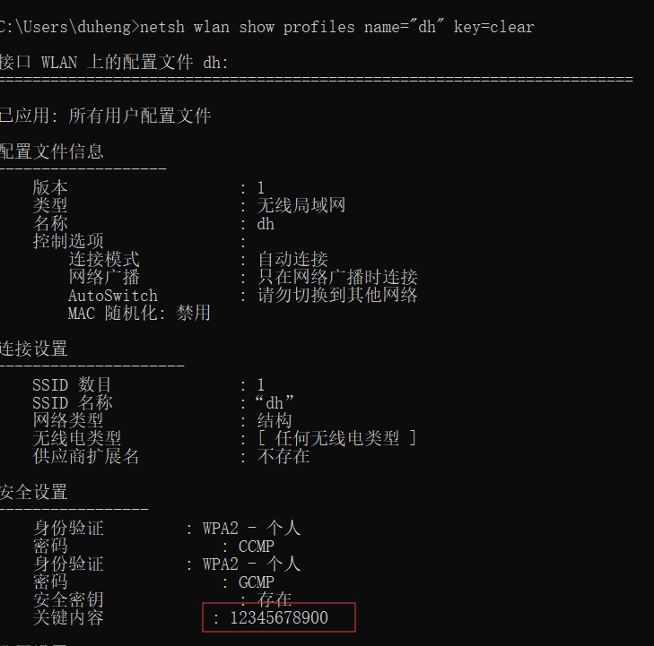

# win10查看wifi密码

### 1.win + R 打开 cmd命令行
 

### 2.输入命令: 列出所有链接过的wifi配置名

 `netsh wlan show profiles`
  
 

### 3.输入命令：查看具体wifi配置，包含wifi密码

 `netsh wlan show profiles name="wifi配置名" key=clear `
  
 
